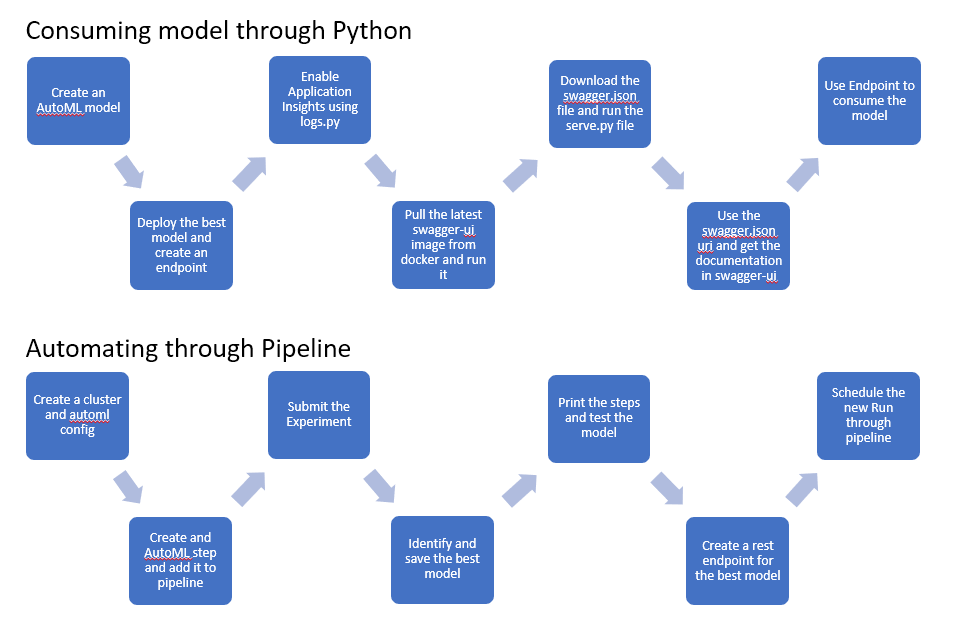

# Operationalizing Machine Learning

## Overview
In this project we have we used Azure ML to create a machine learning model and deploy it on the production environment to publish and consume it. We first ran an AutoML experiement to identify the best model for our Bank-Marketing dataset and then deployed the best model which is Voting Ensemble and then consumed it through the endpoint.py file. We also documented our model using the swagger UI. Then to automate all of this we created a pipeline in the notebook and included all the steps that created an AutoML model and then trained it. Then in this also we saved the best model as pickel. We also tested our best running model using a test dataset and created a confusion matrix. Then we created a rest endpoint to this best model and then scheduled an experiment on it.

## Data
The data is taken from the UCI repository: [UCI Machine Learning Repository: Bank Marketing Data Set](https://archive.ics.uci.edu/ml/datasets/Bank+Marketing). 

#### Attribute Information:

Input variables:  
bank client data:  
1 - age (numeric)  
2 - job : type of job (categorical: 'admin.','blue-collar','entrepreneur','housemaid','management','retired','self-employed','services','student','technician','unemployed','unknown')  
3 - marital : marital status (categorical: 'divorced','married','single','unknown'; note: 'divorced' means divorced or widowed)  
4 - education (categorical: 'basic.4y','basic.6y','basic.9y','high.school','illiterate','professional.course','university.degree','unknown')  
5 - default: has credit in default? (categorical: 'no','yes','unknown')  
6 - housing: has housing loan? (categorical: 'no','yes','unknown')  
7 - loan: has personal loan? (categorical: 'no','yes','unknown')  

related with the last contact of the current campaign:  
8 - contact: contact communication type (categorical: 'cellular','telephone')  
9 - month: last contact month of year (categorical: 'jan', 'feb', 'mar', ..., 'nov', 'dec')  
10 - day_of_week: last contact day of the week (categorical: 'mon','tue','wed','thu','fri')  
11 - duration: last contact duration, in seconds (numeric). Important note: this attribute highly affects the output target (e.g., if duration=0 then y='no'). Yet, the duration is not known before a call is performed. Also, after the end of the call y is obviously known. Thus, this input should only be included for benchmark purposes and should be discarded if the intention is to have a realistic predictive model.  

other attributes:  
12 - campaign: number of contacts performed during this campaign and for this client (numeric, includes last contact)  
13 - pdays: number of days that passed by after the client was last contacted from a previous campaign (numeric; 999 means client was not previously contacted)  
14 - previous: number of contacts performed before this campaign and for this client (numeric)  
15 - poutcome: outcome of the previous marketing campaign (categorical: 'failure','nonexistent','success')  

social and economic context attributes  
16 - emp.var.rate: employment variation rate - quarterly indicator (numeric)  
17 - cons.price.idx: consumer price index - monthly indicator (numeric)  
18 - cons.conf.idx: consumer confidence index - monthly indicator (numeric)  
19 - euribor3m: euribor 3 month rate - daily indicator (numeric)  
20 - nr.employed: number of employees - quarterly indicator (numeric)  
  
Output variable (desired target):  
21 - y - has the client subscribed a term deposit? (binary: 'yes','no')

Note: The above information about the features is taken from [UCI Machine Learning Repository: Bank Marketing Data Set](https://archive.ics.uci.edu/ml/datasets/Bank+Marketing)

## Architectural Diagram
The Architectural diagram is as follows. This covers the most crucial steps we did in the project. 

## Key Steps
1. We have the dataset on which we will be training the ML model which is the bankmarketing dataset.

2. We then created an AutoML experiment and used our bankmarketing dataset to identify the best model.

3. We identified that the best model was a VotingEnsemble which had the accuracy of 92%.

4. We then deployed our best model and created an endpoint

5. To enable the application insight we executed the logs.py

6. We can see that the application insights are enabled

7. We then downloaded the latest docker image using swagger.sh

9. And provided the swagger URI throgh serve.py to get the model documentation. These are the HTTP APIs that are available.

10. And this is the response that our model provides. On successful execution it returns the score otherwise it returns an error code with description.

11. We then copied the rest URI and primary key, updated it in the endpoint.py and executed it to get the output from the model.

12. Then we created the bankmarketing dataset through the notebook

13. Then we created the pipeline

14. Through pipeline we created an autoML experiment and ran it to identify the best model. This is the output of runwidget

15. These are the steps our model performed

16. We then deployed and created an endpoint to schedule the run through pipeline

17. and then scheduled a new AutoML run

## Screen Recording
Here's a link to my Screen recording: https://www.awesomescreenshot.com/video/2403338?key=c8b31d5f38a4212a94eef70e24e18705

## Standout Suggestions
1. We could improve the accuracy of the model even more by including more data
2. We can also include deep learning and allow execution of the models for a longer time to find an even more accurate model
3. We can improve the preprocessing step to improve the input data provided through techniques like ordinal, label or one-hot encoding.
4. We can also normalize the input data to make sure that the values are between 0 to 1. This retains the relative importance of the features.
